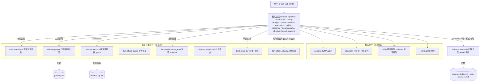

# dsh-redteam-model

> 空了，闲聊。一个老安全人员的关注点：AI环境下，知识点很多知识面也很广，如果一味的给AI投递knowledge，你问它它能答得出来，但是你让它去完成一个任务而没有去给它规定这个任务如何去完成如何高效的去完成如何才能命中你需要的点，尽管它掌握着大量的知识但没有这个"workflow"去引导去把控，那么也许能得到你想要的结果，但是往往非常的浪费token，甚至有时候没有对某些方面的栅栏，它可能陷入死胡同，这就是为什么我们要去不断的设计完善workflow，把自身的经验写成skill或者agent，这样它才能按照workflow去完成任务+从旁的辅助，从而能高效的完成工作。
>
> dsh在安全工作这方面的设计实际上是有限的，只能从playbook中去设计，本身插件的载体还是dp-harness本身，为什么开发这个，也许仅仅因为跟风吧，还是希望DeepSeek能便宜些...（另一方面harness的优势特别明显，就个人而言，在做"反拒绝"上，harness相比claude原生的hook亦或是codex原生的hook又或者其他三方智能体导致封号风险，harness那真的是太easy了。）
>
> 总之一句话，这个项目可能没有大家想的那么好，也没有他们其他人做的那种源码写的引擎看起来炫酷，但立志于一点也只有一点
>
> ————不断完善workflow，用workflow的方式来尽可能补足缺陷；高效+真实是核心。

基于 [dsh](https://www.npmjs.com/package/@deepseek-ai/dsh) web 实现的十个 redteam 安全研究工作模式（预设）及其运行时插件，自包含、可离线部署。目标是服务于 redteam 进行授权安全研究，覆盖渗透测试、红队评估、代码审计、二进制分析、免杀对抗、应急溯源、云安全攻防、CTF 解题与资产测绘领域。

**该项目是为 [https://github.com/deepseek-ai/deepseek-harness](https://github.com/deepseek-ai/deepseek-harness) 赋能的项目，先装好 deepseek-harness 以后，再装该项目；**

> **请勿用于非法行为。** 本项目仅面向已获得书面授权的安全测试、CTF 竞赛、漏洞赏金与安全研究场景（见文末免责声明）。

```
如果各位对插件的方法存在不适用自身的情况，那么可以进行两种更改：
1、源码层，调整各个模式的方法论。
2、在"AttackAtlas"插件中，右上角具备两个功能"自定义工作方法论"&"能力库"，如果内置能力中，没有你需要的能力，可以在"能力库"中添加主类、子类，完成以后再到"自定义工作方法论"中构建属于你的工作方法论（类似于workflow），有问题欢迎提或者自己再改。
```

## 十个工作模式

| 模式 | 定位 |
|---|---|
| `redteam` 安全研究员 | 通用化模式，在这个模式中并没有定义Gate强制链路，一般来说普通的任务都可以在这里询问，但深度任务请切换专业模式！`（专业模式才是初衷）` |
| `pentest` 渗透测试 | Web/API/app/小程序等等专业级渗透； |
| `code-audit` 代码审计 | 白盒源码审计，动静态代码审计 |
| `binary-analysis` 二进制分析 | 病毒分析、逆向破解、脱壳还原 |
| `attack-defense` 攻防评估 | 做了多条主线：web打点+内网环境(内网环境又分Windows场景、Linux场景、有无监测、域环境、云内网等) |
| `av-evasion` 免杀对抗 | 攻击视角的免杀（可用于shell、loader、c2的变形，核心点在于如何对抗模型的"拒绝"） |
| `incident-response` 应急溯源 | Windows/Linux 应急响应与攻击溯源：多场景定义，建议prompt描述好处于什么场景（挖矿、蠕虫、病毒木马攻防下的排查等）——有兴趣的可以看下另一项目dumpall+AI分析，很好用还是。 |
| `cloud-security` 云安全攻防 | 云平台与云原生渗透：这里就不再废话了， |
| `ctf-solver` CTF 解题 | CTF 竞赛解题：题面登记、模块路由（web/pwn/reverse/crypto/misc 等）、解题循环、flag 台账与复盘 |
| `asset-mapping` 资产测绘 | 资产测绘：有FOFA/Hunter/Quake/ZoomEye/Shodan + 子域/DNS 校验 + ICP 备案归属 + 指纹识别，产出可审计的资产清册 Excel（六工作表，看模板） |

每个模式自包含四层资产：——根据dsh模式的设计论

1、**persona**（角色/认识论/边界/报告纪律）

2、**playbook**（方法论与门禁文本契约）

3、**skills**（可加载技能）

4、**refs/**（外部知识库，原文索引化）。

## 运行时插件

| 插件 | 作用 |
|---|---|
| `dsh-stage-gate` | `stage_gate`/`gates_list` 工具：八模式 32 道阶段门的结构校验，判定写入 `gate-log.md`；`operation_goal`/`operation_progress` 目标契约与进度收口（`operation-state.json` 驱动中断恢复） |
| `dsh-route-boost` | 逐轮治理信封 + 十模式全局作战语境条件注入（global-agents）：阶段推断+ 门禁清单 + 模式边界 + 证据等级预判 + refs 指针 + 技能依赖工具面就绪行+ operation 恢复行，任务口径判定、结构化标记块注入、整行粒度预算、变化才投递并落注入量记账 |
| `dsh-sec-enforce` | 确定性工具拦截：报告门、写边界、高危命令先问后做、裸奔扫描限速 |
| `dsh-refusal-guard` | —————反拒绝—————AGENTS.security.md兜底 |
| `dsh-trace-vault` | 过程留痕库：十安全模式会话全量落库工具调用；`trace_search`/`trace_get`/`trace_recent`/`trace_stats` 检索与会话画像； |
| `dsh-auto-advance` | 自动推进器：subagent 执行体返回且意图台账有未收口方向时注入推进提醒；开工三登记一次性提醒；轮数封顶/真人接管重置/冷却窗三护栏，无台账会话零干扰 |
| `dsh-product-subagents` | `subagent_claude_code`/`subagent_codex` provider：无头 spawn 本机 claude/codex CLI，跨 harness 复核按建议项由用户触发 |
| `dsh-mcp-studio` | MCP 加载工作台：通用类 MCP（burpsuite/yakit/chrome-dev-mcp 等）的接入、状态与诊断 |
| `dsh-redteam-results` | redteam 成果：任务台账作战大屏 + 五板式成果页，九模式**跨会话**聚合与时间范围筛选，SQLite 行级持久 |
| `dsh-hunter` | hunter 狩猎：FOFA / Hunter / Quake 三平台资产搜索，代码审计成果页「实测」按钮一键验证（指纹搜索→存活探测→EXP 验证，仅授权资产执行） |
| `dsh-campaign-memory` | 战役记忆：跨会话打法沉淀，同模式同工作区同题写入即刷新不重复，读全文记账、热度×30 天时间衰减排序，按工作区隔离召回，检测指纹 30 天自动清理、目标指纹 180 天到期退场仍可检索； |
| `dsh-mode-group` | 新建会话屏模式选择器两级化：内置模式与研究员模式留顶层，九个专业安全模式折叠进「专业安全模式」悬停/点击子菜单 |
| `dsh-session-pulse` | 会话状态面板（十模式）：头部右上角任务进度 chip（任务清单实时汇总 done/total + 进度条，全部完成转绿）+ 子代理 chip；右侧「子智能体目录」抽屉（正在运行/已结束分组，点名进入子代理会话查看运行内容，打开期间目录实时更新）；对话页左侧「提示词」栏（用户输入按序成列，悬停预览、点击平滑定位到消息并高亮，仅对话标签页可见） |
| `dsh-attack-atlas` | AttackAtlas 攻击面图谱：八专业模式架构矩阵四态点亮与阶段带、目标锚定（覆盖态按目标分账、当前锚定切换、聚合视图，矩阵/阶段带/链路拓扑逐目标独立）、双击派单；自定义工作方法论；工具 / MCP / 自定义工具模块；能力库（自定义主类 / 子类并入图谱与方法论） |
| `dsh-scanner-tools` | 本机扫描器封装：nuclei/httpx/ffuf + 声明式注册表十三工具（nmap·masscan·subfinder·gau·whatweb·wafw00f·dirsearch·sqlmap·nikto·hydra·impacket·netexec·crackmapexec）——六节点工具调用阶梯（本机→MCP→已装替代→MCP 备选→询问安装→脚本）、保守默认+显式覆盖留痕、防盲打登记、全文落盘+预览封顶+连续失败熔断 |
| `dsh-semgrep-audit` | `semgrep_scan` 工具：本机 semgrep 封装 + 预设离线规则集自动定位（java 自建 / php / oss 三层），命中双写 `scan-reconcile.md`/`.csv` 对账（命中≠漏洞，复核补链后经成果登记升格），检测制绝不自动装、`--metrics=off` 离线、产物只落任务工作区 |
| `dsh-webshell-mgr` | webshell 管理：webshell 生成器→ 协议自动识别连接→ 命令执行/文件管理/数据库操作/载荷插件体系，操作台账审计；攻防评估模式立足点作战节方法论接线 |

## 安装

前置：**Node.js >= 22**（DSH 本身要求）。无需预装 pnpm/dsh（经 npx 拉起）；bash/python 非必需。

### 方式一：设置页管理台（推荐）

把整个合集作为一个 dsh 插件安装（需 dsh web 0.1.0-rc.6+，验证于 0.1.1-rc.2）：

```sh
dsh plugin --profile web add github:SeaOf0/dsh-redteam-model
```

打开 dsh web 设置页 → **Redteam Manager**，即可：

- 一键部署十个安全模式（空目录使用整体链接；已有实体 `.agent-presets` 时写入管理器持有的实体副本），也可在模式页一键卸载全部模式（只移除整体链接或管理器持有的实体副本，自带的无关预设与源码树不动）；
- 安装 / 更新 / 卸载十七个运行时插件；
- 查看操作进度与失败原因；最近 50 条记录按 profile 保留，重启时未完成任务会标记为中断失败。

模式复制状态刷新页面即可更新；宿主平面插件安装 / 卸载以及管理器自身更新后需**重启 dsh web** 生效。

插件依赖与 bundle 声明只修改当前 profile；模式位于当前 `DSH_HOME` 的全局 `.agent-presets`，会被该 DSH home 下的 profile 共享。写入 profile 前会备份声明，安装失败时恢复 `package.json` 与 lockfile；卸载子插件只移除运行态声明，不会删除源码。

### 方式二：源码一键部署 CLI

获取源码任选其一：`git clone https://github.com/SeaOf0/dsh-redteam-model.git`，或仓库页 Code → Download ZIP 解压。

```bash
cd dsh-redteam-model/deploy
node deploy.mjs            # 安装：预设链接 + 插件挂载 + 依赖安装（幂等可重跑）
node deploy.mjs --check    # 离线校验：十预设挂载 + 插件真实 loader 路径 + bundle 声明
node deploy.mjs --start    # 后台启动 dsh web → http://127.0.0.1:3080
```

也支持 `npx ./deploy`。Windows（Win10+ 自带 bsdtar）：流程一致，预设链接用 junction 免管理员。

两种安装方式都会把随包的安全预设支撑规范落地为 `~/.dsh/AGENTS.security.md`（本合集专属命名空间），由 `dsh-route-boost` 的 global-agents 上下文**仅注入十个安全模式会话**——其他模式/标准会话零注入、零额外开销；文件随版本更新直达覆盖。早期版本曾把该规范装入 dsh 用户全局文件 `~/.dsh/AGENTS.md`（宿主机制对所有会话无差别生效，会造成跨模式语境污染），升级安装会自动把它收尾为可恢复的备份文件（`.bak-` 前缀）；非本包内容的全局文件绝不触碰。

部署后 2 分钟人工验证：

1. 打开 [http://127.0.0.1:3080](http://127.0.0.1:3080)，roster 列出十个模式（redteam 安全研究员 + 九个专业模式）；
2. 任一会话让模型调 `gates_list`，返回专业模式门禁 schema；
3. pentest/attack-defense/cloud-security/ctf-solver/asset-mapping 会话可见 `nuclei_scan` 等扫描工具（其余模式不可见 = preset 平面正确）；
4. 发起任务后出现 `[route-boost] mode=... phase=...` 运行时信封快照；
5. 未过报告门就写 `reports/` 会被 sec-enforce 拦截并指路。

机器差异项（可选，缺失自动降级）：`claude`/`codex` CLI（跨 harness 双签通道）、nmap/nuclei/httpx/ffuf/jadx/frida/mingw 等工具链（playbook 工具平面检测制 + 三级兜底：检测到的工具 → MCP → 批准后安装）。

## 基础原理与架构

设计原则：**文本纪律（persona/playbook）+ 运行时强制（插件）双层防线**——模型不能自评门禁（结构校验必须是工具调用）、语义门禁归独立复核员、关键发现双签（DSH 复核 + claude/codex 复核一致才进报告）、一切判定落审计 trail（gate-log/enforce-log/evidence-index）。



## 项目结构

```
dsh-redteam-model/
├── modes/                    # 十个模式预设（DSH 发现器经 ~/.dsh/.agent-presets 链接扫描）
│   └── <mode>/
│       ├── preset.yml        # 模式名与定位
│       ├── agent.cordis.yml  # persona + 组合行（工具/技能/MCP/子代理）
│       ├── skills/           # playbook 等模式技能
│       └── refs/             # 知识库（README.md 全量索引，零本机路径）
├── shared/skills/            # 十预设共享技能（生态协作/独立复核/治理/边界）
├── plugins/                  # 十七个运行时插件（各自含 lib/ 测试/README）
└── deploy/                   # 一键部署 CLI（deploy.mjs / verify-deployment.mjs / check-sources.mjs / DEPLOY.md）
```

## 效果展示

| 任务台视图（数据统计展示） | 攻防评估模式（数据统计展示） |
|:---:|:---:|
|  |  |

| 代码审计模式（数据统计展示） | 二进制分析模式（数据统计展示） |
|:---:|:---:|
|  |  |

| hunter 狩猎 | webshell 管理 |
|:---:|:---:|
|  |  |

| AttackAtlas(攻击面图谱) |
|:---:|
|  |

## 发现问题

使用中遇到 bug、误报/漏报、文档与行为不符，请到 [Issues](https://github.com/SeaOf0/dsh-redteam-model/issues) 提交，附：模式名、复现步骤、期望与实际行为、相关日志片段（gate-log/enforce-log/会话输出）。

## 贡献者

感谢参与本项目的贡献者：

- [@yzke](https://github.com/yzke) —— [设置页 Redteam Manager 管理台](https://github.com/SeaOf0/dsh-redteam-model/pull/3)（一键部署/安装/更新/卸载）
- [@SeaOf0](https://github.com/SeaOf0) —— 项目作者与维护者

欢迎通过 Pull Request 参与贡献。

## 致谢

感谢以下项目中的知识点，在这里向作者表达致谢：

- https://github.com/Just-Hack-For-Fun/Linux-INCIDENT-RESPONSE-COOKBOOK
- https://github.com/Just-Hack-For-Fun/Windows-INCIDENT-RESPONSE-COOKBOOK

资产测绘模式全量指纹库重建脚本（`asset-mapping-playbook/scripts/fpdb_update.py`）运行时从以下开源指纹库拉取数据：

- https://github.com/EASY233/Finger
- https://github.com/EdgeSecurityTeam/EHole
- https://github.com/0x727/FingerprintHub
- https://github.com/Mr-xn/Finger

## 开源协议

[MIT License](LICENSE)

## 免责声明

本项目仅供安全研究、教学与**已获授权**的安全测试（渗透测试授权书、CTF、漏洞赏金计划范围内）使用。使用者必须：

- 在获得目标系统所有者书面授权的前提下使用；
- 遵守所在地区法律法规；
- 对使用本项目造成的任何后果自行承担责任。

作者与贡献者不对任何滥用行为负责，且不承担任何直接或间接损失的责任。**请勿用于非法行为。**
